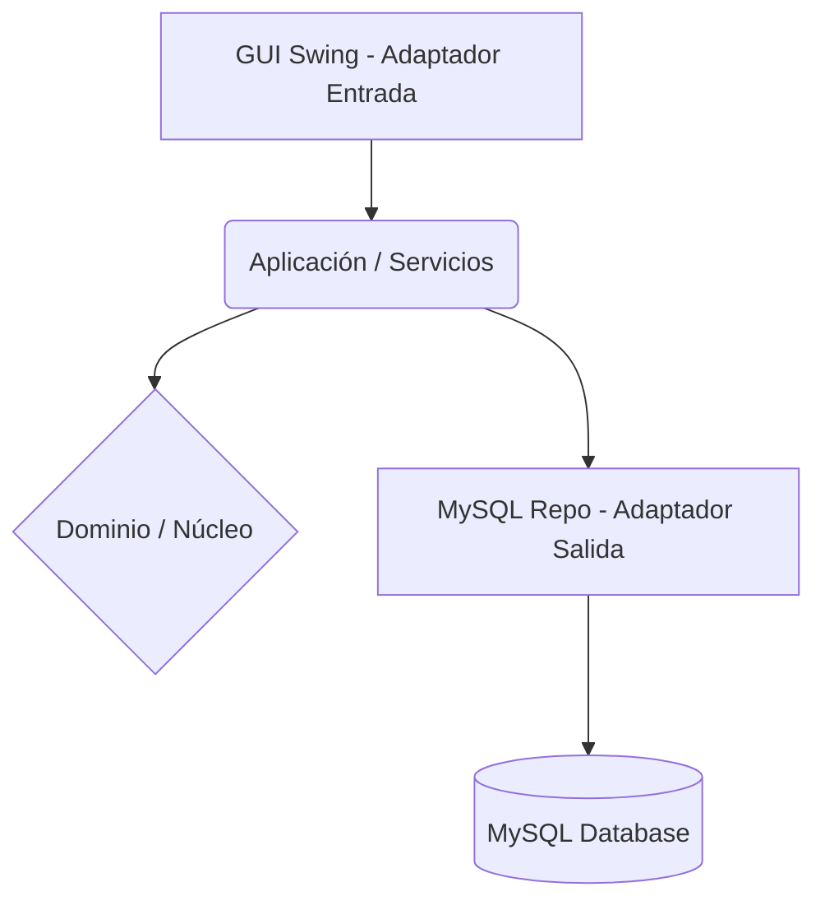

# Sistema de Gestión de Call Center (MySQL Edition)


Características

- [x] Auto-Database Deployment (Detección y creación automática de BD)

- [x] Arquitectura Hexagonal (Puertos y Adaptadores)

- [x] Persistencia robusta con MySQL JDBC

- [x] Interfaz Gráfica nativa (Java Swing)

- [x] Seguridad contra Inyección SQL (PreparedStatement)

- [x] Integridad referencial cruzada

- [x] Manejo de excepciones de dominio (CallCenterException)

- [x] Configuración externa mediante Properties


    > [!NOTE]
    > **Requisitos Previos**
    
    > - Java JDK 11 o superior
    
    > - Maven
    
    > - MySQL Server 8.0+ (XAMPP, WAMP o Community)
    
    > - Servicio MySQL en ejecución

##Tecnologías Utilizadas
TecnologíaVersiónPropósitoJava11+Lenguaje y Lógica (Core)MySQL8.0+Motor de Base de DatosJDBCLatestConexión y PersistenciaJava SwingNativeInterfaz Gráfica (GUI)MavenLatestGestión de dependencias

## Estructura del Proyecto
```
com.udc.callcenterdesktop/
├── dominio (NÚCLEO)/
│   ├── modelo              # Entidades (Agente, Cliente, Llamada)
│   └── puertos             # Interfaces (Repositorios y Servicios)
│
├── aplicacion (LÓGICA)/
│   ├── servicios           # Casos de uso y Validaciones de Negocio
│   └── mapper              # Conversión DTO <-> Entidad
│
└── infraestructura (ADAPTADORES)/
    ├── entrada             # GUI (Java Swing)
    └── salida              # Persistencia (MySQL JDBC Implementation)
```

#Inicio Rápido
Innovación: "Auto-Database Deployment" 🚀Este sistema es inteligente. No necesitas ejecutar scripts SQL manualmente.
Detecta: Verifica si callcenter_db existe.
Crea: Si no existe, construye tablas y relaciones automáticamente.
Despliega: El usuario final solo necesita el servicio MySQL encendido.


##1. Clonar el repositorio
```
git clone https://github.com/tu-usuario/CallCenterHexagonal.git
```
cd CallCenterHexagonal
```
##2. Configurar Credenciales
```
Edita el archivo src/main/resources/config.properties
con tus credenciales locales:Properties
# Driver oficial de MySQL 8
```
db.driver=com.mysql.cj.jdbc.Driver
```
# Conexión al servidor local (Auto-create enabled)
```
db.url=jdbc:mysql://localhost:3306/callcenter_db?useSSL=false&allowPublicKeyRetrieval=true&serverTimezone=UTC
```
# Credenciales de tu MySQL Server local
```
db.user=root
db.password=123456
```
##3. Ejecutar la AplicaciónCompila y ejecuta la clase principal. La primera vez verás en consola cómo se autogenera la estructura de datos.
```
mvn clean compile exec:java -Dexec.mainClass="com.udc.callcenterdesktop.Main"
```
(O ejecuta Main.java desde tu IDE favorito)

### Modelo de Datos
El sistema gestiona 4 entidades principales con relaciones fuertes:
EntidadDescripciónAgentesPersonal del call center.ClientesBase de datos de contactos.CampañasProyectos de marketing activos.LlamadasRegistro transaccional (Vincula Agente + Cliente + Campaña).

#### Ingeniería y Arquitectura

Integridad y Seguridad
- Integridad Referencial: Validaciones cruzadas en capa de servicio y restricciones FOREIGN KEY en base de datos.
- Seguridad: Uso estricto de PreparedStatement para sanitizar consultas y prevenir inyección SQL.

#### Manejo de Errores
> [!TIP]Wrapper de Excepciones:El sistema atrapa excepciones SQL de bajo nivel y las convierte en excepciones de dominio legibles (CallCenterException) para que la interfaz gráfica pueda mostrar mensajes amigables al usuario.

##### Arquitectura Hexagonal

###### Autores
Proyecto desarrollado como parte de la asignatura de Arquitectura de Software.
###### Jose Rivera
- Módulo de Agente y Cliente
- Lógica de Negocio y Validaciones
- Migración a MySQL Server
###### Carlos Molano
- Infraestructura y Configuración
- Módulo de Llamada y Campaña
- Adaptadores y Base de datos (Prototipo)

 ###### Made with ❤️ and Java Swing.


